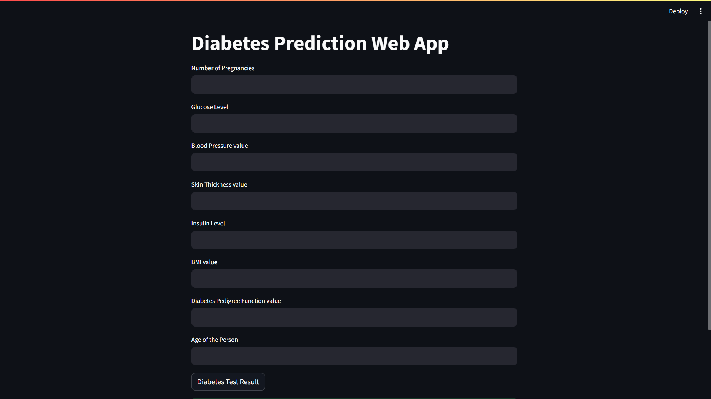
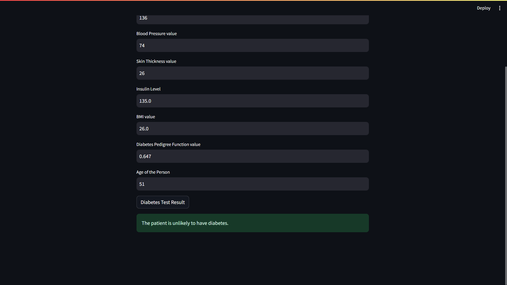

## Diabetes Analysis App
This project presents an interactive web application for analyzing diabetes-related data. 

## Installation
To run the Diabetes Analysis App locally, follow these steps:

1.Clone this repository to your local machine.
2.Navigate to the project directory.
3.Install the required dependencies:
-> pip install -r requirements.txt
-> streamlit run app.py

## Usage
Upload your diabetes dataset or use sample data provided within the app.

# Screenshot of the project

